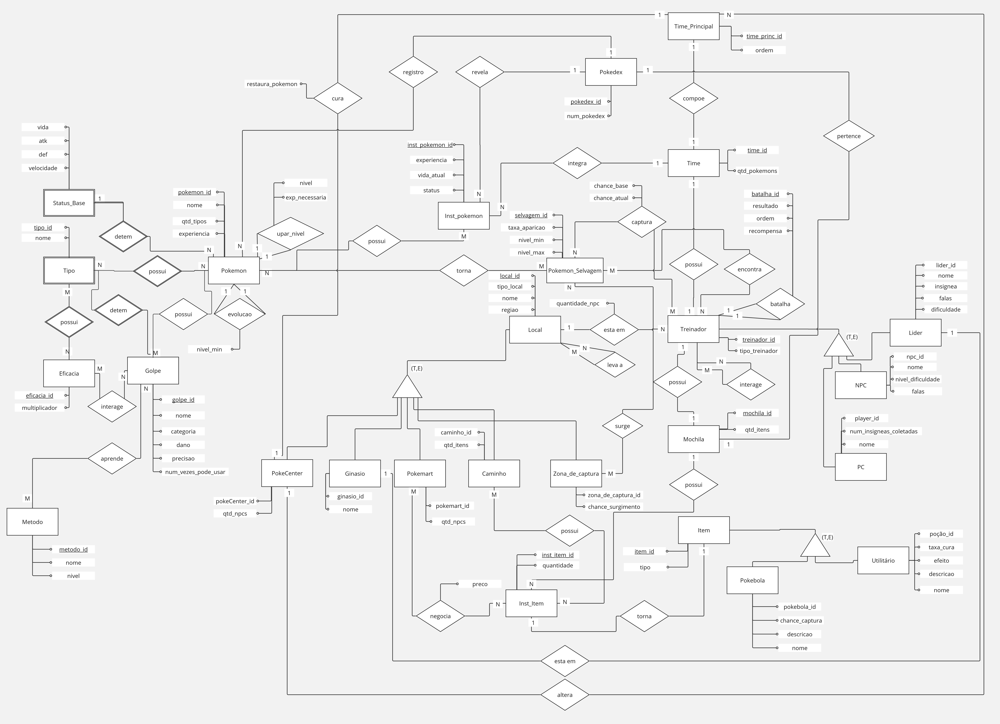

# DER - Diagrama Entidade Relacionamento

O DER (Diagrama Entidade-Relacionamento) é uma ferramenta de modelagem utilizada em projetos de banco de dados para representar, de forma visual, as entidades, os relacionamentos entre elas e os atributos envolvidos. Ele ajuda a entender e projetar a estrutura lógica de um banco de dados, servindo como um guia para sua implementação.

