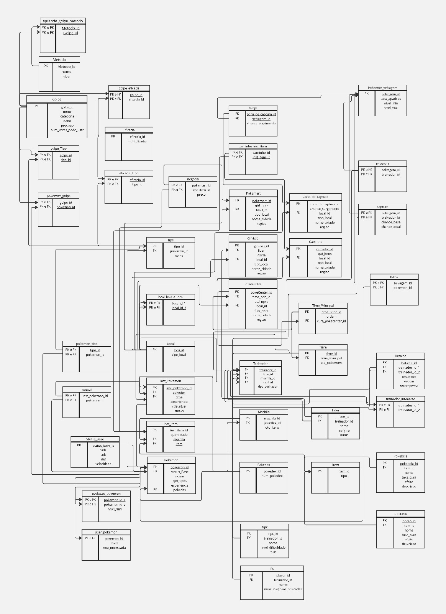

# Modelo Relacional

O Modelo Relacional(MREL) exemplifica a parte lógica de como as entidades e os relacionamentos serão mapeados no banco de dados. Com um nivel de abstração consideravelmente não dependente de um sistema de gerenciamento de banco de dados (SGBD) em especifico, este modelo é um modelo bem idependente e util.

<b>Autor:</b> <a href="https://github.com/mauricio-araujoo">Mauricio Ferreira</a>, 2024

